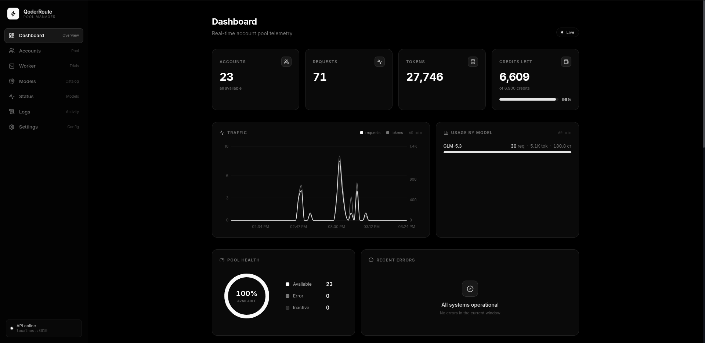

# QoderRoute

QoderRoute is an OpenAI-compatible and Anthropic-compatible proxy router for Qoder (qoder.sh). It maintains a pool of Qoder accounts (via PAT tokens), accepts requests formatted for the OpenAI chat API at `/v1/chat/completions` and the Anthropic Messages API at `/v1/messages`, signs outbound requests through a Node.js WASM sidecar, forwards them to Qoder upstream endpoints (`api1/2/3.qoder.sh`), and automatically rotates between accounts when quota is exhausted. The project includes a React + TypeScript admin panel for monitoring accounts, quotas, the Qoder model catalog and credit multipliers, model health, live request logs via SSE, and runtime settings.

## Dashboard Preview



*Real-time pool telemetry: account health, traffic, per-model usage, credits, and live error monitoring.*

## Features

- **Account Pool with Fill‑First Rotation**  
  Accounts are ordered by priority (descending) then ID (ascending). The first available account with remaining quota serves until it exhausts, then the next in line takes over.

- **Quota Tracking & Plan Metadata**  
  Every account's plan tier, name, end date, and quota usage are fetched from `openapi.qoder.sh`. The background loop refreshes this every 5 minutes. Account cards display plan type, paid/free status, plan end date, and quota progress. When an account hits quota, it is parked and will automatically rejoin rotation once credits renew. Paid plan names are derived from the quota size, since the plan endpoint does not distinguish tiers: 2,000 credits → Pro Plan, 6,000 → Pro+ Plan, 20,000 → Ultra Plan (trials keep their API-reported name, e.g. Pro Trial with 300 credits).

- **Free-Tier Rejection on Add**  
  Adding an account validates the PAT over HTTP (job-token exchange + userinfo — no CLI required) and then checks the plan. Accounts on the free tier (`personal_standard`, no paid plan) are rejected with a clear error instead of being parked as exhausted right away. Accounts with a plan but no remaining quota are still added and parked, so they rejoin automatically when the plan renews.

- **Rate-Limit vs Quota Distinction**  
  Transient 429 / rate-limit responses never park or delete an account — only genuine quota-exhaustion signals do (quota / credits-exhausted markers). Rate-limited accounts get the normal failure cooldown and recover automatically.

- **Model Catalog & Credit Multipliers**
  The Models page lists all currently mirrored Qoder routes with their canonical key, display name, base credit factor, context capability, vision support, and separate Reasoning/Thinking flags. The same catalog drives request routing, `/v1/models`, `/api/models/catalog`, account model selectors, and health probes.

- **Configurable Model Health Probes with TPS**
  Periodic probes measure liveness and tokens-per-second (TPS) only for the models selected in **Settings → Models Probe**. Both the interval and model list are persisted. Expensive models such as Cantus and generic tier routes are available but intentionally opt-in because every probe is a real upstream request.

- **Live Logs via SSE**  
  An SSE stream replays recent events then pushes new ones in real time (`GET /api/logs/stream`). Sources include chat completions, account events, provisioning, and routing updates.

- **Runtime Settings**  
  All configuration values are persisted in the database and editable via `/api/settings`. Options control log visibility, token/email/request display, auto-delete behavior for exhausted accounts, Qoder backend endpoint selection, probe frequency, and the exact models included in each probe cycle.

- **Auto-Delete Exhausted Accounts Option**  
  When enabled, accounts marked as quota-exceeded are removed from the pool.

- **OpenAI-Compatible API**  
  The `/v1/chat/completions` endpoint accepts standard OpenAI request fields (messages, tools, reasoning_effort, context_window, max_tokens, etc.) and returns streaming SSE chunks matching the OpenAI response shape. `/v1/models` lists canonical model IDs, display names, and Qoder base credit factors.

- **Anthropic-Compatible API**  
  The `/v1/messages` endpoint speaks the Anthropic Messages API natively — block-based content (text / thinking / tool_use / tool_result / image), `input_schema` tools, and named SSE events (`message_start`, `content_block_delta`, `message_delta`, ...) — so clients like Claude Code or any anthropic-sdk tool work without an adapter. Claude model-name hints map onto Qoder tiers (`opus` → Ultimate, `sonnet` → Performance, `haiku` → Efficient); usage (`input_tokens` / `output_tokens`) is reported in both streaming and non-streaming responses and counts toward the same Usage charts and account quotas as OpenAI traffic.

## Model Catalog

Credit values are base multipliers mirrored from Qoder's catalog, not fixed per-request prices. Actual upstream billing can vary.

`Reasoning` and `Thinking` are deliberately separate below. `Reasoning` is Qoder's model capability flag; `Thinking` means the catalog exposes a thinking mode. For example, Kimi-K3 is not classified as a reasoning model, but it supports thinking with `low`, `high`, and `max` effort.

| Name | Canonical key | Credits | Reasoning | Thinking |
|------|---------------|---------|-----------|----------|
| Auto | `auto` | 1.0× | No | No |
| Ultimate | `ultimate` | 1.6× | Yes | Yes |
| Performance | `performance` | 1.1× | No | Yes |
| Efficient | `efficient` | 0.3× | No | No |
| Lite | `lite` | 0× / free | No | No |
| Cantus | `cmodel` | 3.2× | Yes | Yes |
| Qwen3.8-Max | `qmodel_38max` | 0.5× | Yes | Yes |
| Qwen3.7-Max | `qmodel_latest` | 0.5× | No | Yes |
| Qwen3.7-Plus | `qmodel` | 0.1× | No | Yes |
| Kimi-K3 | `kmodel_latest` | 0.8× | No | Yes (`low` / `high` / `max`) |
| Kimi-K2.7-Code | `kmodel` | 0.3× | No | No |
| GLM-5.3 | `gmodel` | 0.6× | Yes | Yes (`low` / `high` / `max`) |
| GLM-5.2 | `gm51model` | 0.6× | Yes | Yes |
| DeepSeek V4 Pro 0813 | `dmodel` | 0.5× | Yes | Yes |
| DeepSeek V4 Flash 0731 | `dfmodel` | 0.1× | Yes | Yes |
| MiniMax-M3 | `mmodel` | 0.2× | No | No |

## Architecture

```
+-----------+      HTTP          +--------------+      HTTP      +------------------+
|   Client   | ----------------> | FastAPI :8010 | -------------> | Signer :8123      |
+-----------+                   +--------------+                  | (Node.js/WASM)   |
                                                                  +------+-----------+
                                                                         |
                                                                         | HTTPS
                                                                         v
                                                                  +--------------+
                                                                  | Qoder Upstream |
                                                                  | api1/2/3.qoder |
                                                                  +----------------+

Data Layer:
  - SQLite: data/qoderroute.db (accounts, settings, counters)
  - Frontend: built from frontend/dist (SPA fallback served by FastAPI)

Background Loops:
  - Quota refresher: every 300 seconds (pool.refresh_all_quotas)
  - Model prober: configurable interval via settings
  - Signer supervisor: monitors signer process; restarts if unhealthy
```

## Requirements

- Python 3.11+
- Node.js 18+ (for the signer sidecar)
- npm (to build the frontend)

## Setup

### Prerequisites

The repo ships with the WASM auth module (`backend/signer/qoder_auth_wasm.wasm`, extracted from Qoder CLI 1.1.17) — no extra steps needed, the signer works out of the box.

### Backend Installation

```bash
cd backend
python3 -m venv .venv
source .venv/bin/activate
pip install -r requirements.txt
```

Optionally configure environment variables in `.env` (see Configuration below). The backend reads these via pydantic-settings at startup.

### Frontend Build

```bash
cd frontend
npm install
npm run build
```

The build output is placed in `frontend/dist`. The production backend serves these files under `/` with SPA routing.

### Running the Server

**Production (no reload):**

```bash
cd backend
./start.sh
```

The server binds to `0.0.0.0:8010`. Use `./restart.sh` for a graceful restart that preserves the signer process.

**Development (auto-reload):**

```bash
cd backend
python3 run.py
```

This starts uvicorn with hot-reload enabled when `DEBUG=true` in `.env`.

**Frontend Development:**

```bash
cd frontend
npm run dev
```

Vite runs on `http://localhost:5173` and proxies `/api` and `/v1` to `http://localhost:8010`.

### Tests

`backend/tests/` is a local, gitignored regression suite and is not shipped in the public repository. If that directory is present in your development checkout:

```bash
cd backend
python3 -m pytest tests/
```

Install test dependencies separately (pytest and pytest-asyncio):

```bash
pip install pytest pytest-asyncio
```

## Configuration

Environment variables are loaded from `backend/.env` (pydantic-settings field mapping to UPPER_SNAKE_CASE). Common options:

| Variable                   | Default                              | Description                                             |
|----------------------------|--------------------------------------|---------------------------------------------------------|
| `DEBUG`                    | `False`                              | Enable debug mode / SQL echo                           |
| `HOST`                     | `0.0.0.0`                            | Host to bind to                                         |
| `PORT`                     | `8010`                               | HTTP port                                               |
| `DATABASE_URL`             | `sqlite+aiosqlite:///./data/qoderroute.db` | Database URL                                          |
| `JWT_SECRET`               | `qoderroute-super-secret-key...`     | Reserved (JWT auth is not wired yet)                    |
| `JWT_ALGORITHM`            | `HS256`                              | Reserved                                                |
| `ACCESS_TOKEN_EXPIRE_MINUTES` | `1440`                             | Reserved                                                |
| `QODERCLI_PATH`            | ``                                   | Legacy; not required — PAT validation runs over HTTP    |
| `QODER_POLL_INTERVAL`      | `300`                                | Seconds between pool refreshes                          |
| `ACCOUNT_COOLDOWN_SECONDS` | `30`                                 | Base backoff on consecutive failures                    |
| `MAX_CONSECUTIVE_FAILURES` | `3`                                  | Max failures before cooldown                            |
| `CORS_ORIGINS`             | `["http://localhost:5173", ...]`     | Allowed origins                                         |
| `DATA_DIR`                 | `./data`                             | Data directory path                                     |
| `QODER_WORKER_SCRIPT`      | ``                                   | Optional; enables extra API module not shipped in public build |
| `QODER_INFER_BASE`         | (settings-based default)             | Optional env override for Qoder backend (api1/api2/api3)|

Settings managed via `/api/settings` (stored in DB):

- `worker_logs_enabled`, `worker_retry_allow`
- `accounts_show_email`, `accounts_show_tokens`, `accounts_show_requests`
- `accounts_auto_delete_exhausted`
- `qoder_infer_base` (`api1` | `api2` | `api3`)
- `probe_interval_minutes` (0 = disabled; otherwise 5–60 min steps)
- `probe_model_keys` (ordered list of canonical model keys; an empty list probes nothing)

## API Overview

**OpenAI-Compatible Endpoints**

- `POST /v1/chat/completions` — Chat completion (streaming SSE or JSON). Request schema follows `ChatCompletionRequest`. Accepts messages, tools, reasoning_effort, fast mode, context_window, max_tokens.
- `GET /v1/models` — List supported canonical model IDs with display names and `credit_factor`.

**Anthropic-Compatible Endpoints**

- `POST /v1/messages` — Anthropic Messages API (streaming SSE or JSON). Handles block-based content, `input_schema` tools, `thinking` budgets, and reports usage as `input_tokens` / `output_tokens`.
- `POST /v1/messages/count_tokens` — Rough token estimate for the upcoming request.

**Admin REST API**

- `GET POST /api/accounts` — List accounts or create a new account (PAT validation required). Includes filter views: `GET /api/accounts/available`, `GET /api/accounts/exhausted`.
- `GET /api/accounts/{id}` — Get account details.
- `PATCH /api/accounts/{id}` — Update account fields.
- `DELETE /api/accounts/{id}` — Delete account.
- `POST /api/accounts/{id}/quota/refresh` — Refresh quota for one account.
- `POST /api/accounts/quota/refresh-all` — Refresh all active accounts' quotas.
- `GET /api/accounts/stats/dashboard` — Dashboard statistics.
- `GET /api/accounts/stats/activity` — Recent traffic aggregated by minute and model.
- `GET /api/accounts/models/list` — Available model tiers.
- `GET /api/models/catalog` — Full router catalog with keys, credit factors, context windows, Reasoning/Thinking, and vision capabilities.
- `GET /api/status/models` — Model health snapshot (TPS, latency, alive/error).
- `GET /api/logs` — Recent log events.
- `GET /api/logs/stream` — SSE stream of live logs.
- `GET /api/settings` — Current settings.
- `PUT /api/settings` — Update settings.
- `GET /api/health` — Health check (200 ok, 503 degraded if signer unavailable).
- `GET /api/health/live` — Liveness probe (always OK).

## Development

- **Frontend Dev Server**: Run `npm run dev` inside `frontend/`. Vite listens on port 5173 and proxies `/api` and `/v1` to the backend. The dev server works even without building the production bundle first.

- **Backend Dev Mode**: Run `python3 run.py` from `backend/`. When `DEBUG=true`, uvicorn reloads on changes. Ensure the signer is running (it starts automatically with the backend via `ensure_signer` in lifespan).

- **Tests**: The local regression suite lives in the gitignored `backend/tests/` directory when available. It uses pytest with asyncio support: `cd backend && python3 -m pytest tests/`. A clean public clone does not contain this directory.

## License & Notice

This is an unofficial third-party project. It is not affiliated with, endorsed by, or associated with Qoder or its operators. Use at your own risk. This software redistributes authenticated user credentials (PAT tokens); ensure compliance with applicable terms of service and handle credentials securely.
