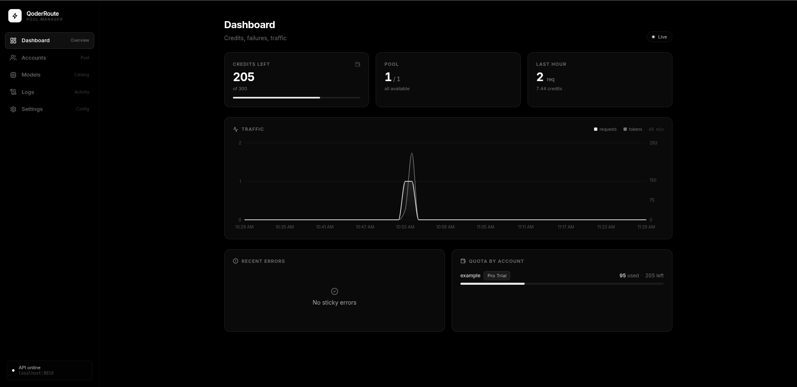

# QoderRoute

QoderRoute is an OpenAI-compatible and Anthropic-compatible proxy router for Qoder (qoder.sh). It maintains a pool of Qoder accounts (via PAT tokens), accepts requests formatted for the OpenAI chat API at `/v1/chat/completions` and the Anthropic Messages API at `/v1/messages`, signs outbound requests through a Node.js WASM sidecar, forwards them to Qoder upstream endpoints (`api1/2/3.qoder.sh`), and automatically rotates between accounts when quota is exhausted. The project includes a React + TypeScript admin panel for accounts, quotas, the model catalog, live request logs via SSE, and runtime settings.

## Dashboard Preview



*Credits left, pool availability, last-hour traffic (from persisted request summaries), recent errors, and per-account quota.*

## Features

- **Dashboard**  
  Slim ops overview: pool credits remaining, available/cooldown/exhausted counts, last-hour request/credit totals, a 60‑minute traffic chart, sticky account errors, and per-account quota bars (with plan chips). Traffic for the hour is built from request summaries so it survives a backend restart (until Clear / retention wipe).

- **Account Pool with Fill‑First Rotation**  
  Accounts are ordered by priority (descending) then ID (ascending). The first available account with remaining quota serves until it exhausts, then the next in line takes over. Near exhaustion, concurrent starts spill onto the next account so a request burst does not all fail on the same dying PAT. The same PAT cannot be added twice.

- **Quota Tracking & Plan Metadata**  
  Every account's plan tier, name, end date, and quota usage are fetched from `openapi.qoder.sh`. The background loop refreshes non-exhausted accounts every 5 minutes. Account cards display plan type, paid/free status, plan end date, and quota progress. When an account hits quota, it is parked (or deleted, if auto-delete is on). Parked accounts are not polled; refresh the card via **Accounts** (or `POST /api/accounts/{id}/quota/refresh`) to rejoin rotation once credits are back. Paid plan names are derived from the quota size, since the plan endpoint does not distinguish tiers: 2,000 credits → Pro Plan, 6,000 → Pro+ Plan, 20,000 → Ultra Plan (trials keep their API-reported name, e.g. Pro Trial with 300 credits).

- **Free-Tier Rejection on Add**  
  Adding an account validates the PAT over HTTP (job-token exchange + userinfo — no CLI required) and then checks the plan. The account name is optional: when omitted, the router fills it from the Qoder profile (`/api/v1/userinfo`). Accounts on the free tier (`personal_standard`, no paid plan) are rejected with a clear error instead of being parked as exhausted right away. Accounts with a plan but no remaining quota are still added and parked; they rejoin when you refresh them after credits return.

- **Rate-Limit vs Quota Distinction**  
  Transient 429 / rate-limit responses never park, delete, or cooldown an account — only genuine quota-exhaustion signals do (quota / credits-exhausted markers). Rate limits are treated as infrastructure backpressure and left for the client to retry.

- **Model Catalog & Credit Multipliers**
  The Models page lists all currently mirrored Qoder routes with their canonical key, display name, base credit factor, context capability, vision support, and separate Reasoning/Thinking flags. The same catalog drives request routing, `/v1/models`, `/api/models/catalog`, and account model selectors.

- **Live Logs via SSE**  
  The Logs page has two views: **Requests** (result, account, tokens, credits, latency + per-request Timeline drawer) and **Pool** (account lifecycle: added / removed / parked / auto-deleted / cooldown / restored). Account cards deep-link with `?account=` (matches current id or the same account name after a delete/re-add). `GET /api/logs/stream` pushes updates; `DELETE /api/logs` clears the ring buffer, in-memory request index, and 24h `request_summaries`. Request summaries persist 24h; pool lifecycle events are ring-buffer only.

- **Runtime Settings**  
  All configuration values are persisted in the database and editable via `/api/settings`. Options control worker log visibility (when the optional worker is present), token/email/request display on account cards, auto-delete behavior for exhausted accounts, and Qoder backend endpoint selection (`api1` / `api2` / `api3`).

- **Auto Cosy/CLI Version**  
  The router reads the published `@qoder-ai/qodercli` version from npm and applies it to Cosy headers, the business envelope, and the signer context — no hand edits on every CLI release.

- **Auto-Delete Exhausted Accounts Option**  
  When enabled, accounts marked as quota-exceeded are removed from the pool (including an immediate sweep of already-parked rows).

- **OpenAI-Compatible API**  
  The `/v1/chat/completions` endpoint accepts standard OpenAI request fields (messages, tools, tool_choice, reasoning_effort, context_window, max_tokens, etc.) and returns streaming SSE chunks matching the OpenAI response shape. `/v1/models` lists canonical model IDs, display names, credit factors, context windows, and Reasoning/Vision flags.

- **Anthropic-Compatible API**  
  The `/v1/messages` endpoint speaks the Anthropic Messages API natively — block-based content (text / thinking / tool_use / tool_result / image), `input_schema` tools, and named SSE events (`message_start`, `content_block_delta`, `message_delta`, ...) — so clients like Claude Code or any anthropic-sdk tool work without an adapter. Claude model-name hints map onto Qoder tiers (`opus` → Ultimate, `sonnet` → Performance, `haiku` → Efficient); context-window suffixes such as `[1m]` / `[200k]` are stripped. Usage (`input_tokens` / `output_tokens`) is reported in both streaming and non-streaming responses and counts toward the same Usage charts and account quotas as OpenAI traffic.

## Model Catalog

Credit values are base multipliers mirrored from Qoder's catalog, not fixed per-request prices. Actual upstream billing can vary.

`Reasoning` and `Thinking` are deliberately separate below. `Reasoning` is Qoder's model capability flag; `Thinking` means the catalog exposes a thinking mode. For example, Kimi-K3 is not classified as a reasoning model, but it supports thinking with `low`, `high`, and `max` effort.

| Name | Canonical key | Credits | Reasoning | Thinking |
|------|---------------|---------|-----------|----------|
| Auto | `auto` | 1.0× | No | No |
| Ultimate | `ultimate` | 1.6× | Yes | Yes |
| Performance | `performance` | 1.1× | No | Yes |
| Efficient | `efficient` | 0.3× | No | No |
| Lite | `lite` | 0× / free | No | No |
| Cantus | `cmodel` | 3.2× | Yes | Yes |
| Qwen3.8-Max | `qmodel_38max` | 0.5× | Yes | Yes |
| Qwen3.8-Flash | `qfmodel` | 0.1× | Yes | Yes |
| Qwen3.7-Max | `qmodel_latest` | 0.5× | No | Yes |
| Qwen3.7-Plus | `qmodel` | 0.1× | No | Yes |
| Kimi-K3 | `kmodel_latest` | 0.8× | No | Yes (`low` / `high` / `max`) |
| Kimi-K2.7-Code | `kmodel` | 0.3× | No | No |
| GLM-5.3 | `gmodel` | 0.6× | Yes | Yes (`low` / `high` / `max`) |
| GLM-5.3-Flash | `gfmodel` | 0.05× | Yes | Yes |
| DeepSeek-V4-Pro | `dmodel` | 0.8× | Yes | Yes |
| DeepSeek-V4-Flash | `dfmodel` | 0.3× | Yes | Yes |
| MiniMax-M3 | `mmodel` | 0.2× | No | No |

## Architecture

```
+-----------+      HTTP          +--------------+      HTTP      +------------------+
|   Client   | ----------------> | FastAPI :8010 | -------------> | Signer :8123      |
+-----------+                   +--------------+                  | (Node.js/WASM)   |
                                                                  +------+-----------+
                                                                         |
                                                                         | HTTPS
                                                                         v
                                                                  +--------------+
                                                                  | Qoder Upstream |
                                                                  | api1/2/3.qoder |
                                                                  +----------------+

Data Layer:
  - SQLite: data/qoderroute.db (accounts, settings, counters, request summaries)
  - Frontend: built from frontend/dist (SPA fallback served by FastAPI)

Background Loops:
  - Quota refresher: every 300 seconds (non-exhausted accounts only)
  - Signer supervisor: monitors signer process; restarts if unhealthy
  - Cosy/CLI version: npm latest on startup and every 6 hours
```

## Requirements

- Python 3.11+
- Node.js 18+ (for the signer sidecar)
- npm (to build the frontend)

## Setup

### Backend Installation

```bash
cd backend
python3 -m venv .venv
source .venv/bin/activate
pip install -r requirements.txt
```

Optionally configure environment variables in `.env` (see Configuration below). The backend reads these via pydantic-settings at startup.

### Frontend Build

```bash
cd frontend
npm install
npm run build
```

The build output is placed in `frontend/dist`. The production backend serves these files under `/` with SPA routing.

### Running the Server

**Production (no reload):**

```bash
cd backend
./start.sh          # Linux / macOS
# start.bat         # Windows
```

The server binds to `0.0.0.0:8010`. Use `./restart.sh` (or `restart.bat` on Windows) for a graceful restart that preserves the signer process.

**Development (auto-reload):**

```bash
cd backend
python3 run.py
```

This starts uvicorn with hot-reload enabled when `DEBUG=true` in `.env`.

**Frontend Development:**

```bash
cd frontend
npm run dev
```

Vite runs on `http://localhost:5173` and proxies `/api` and `/v1` to `http://localhost:8010`.

### Tests

`backend/tests/` is a local, gitignored regression suite and is not shipped in the public repository. If that directory is present in your development checkout:

```bash
cd backend
python3 -m pytest tests/
```

Install test dependencies separately (pytest and pytest-asyncio):

```bash
pip install pytest pytest-asyncio
```

## Configuration

Environment variables are loaded from `backend/.env` (pydantic-settings field mapping to UPPER_SNAKE_CASE). Common options:

| Variable                   | Default                              | Description                                             |
|----------------------------|--------------------------------------|---------------------------------------------------------|
| `DEBUG`                    | `False`                              | Enable debug mode / SQL echo                           |
| `HOST`                     | `0.0.0.0`                            | Host to bind to                                         |
| `PORT`                     | `8010`                               | HTTP port                                               |
| `DATABASE_URL`             | `sqlite+aiosqlite:///./data/qoderroute.db` | Database URL                                          |
| `JWT_SECRET`               | `qoderroute-super-secret-key...`     | Unused leftover                                         |
| `JWT_ALGORITHM`            | `HS256`                              | Unused leftover                                         |
| `ACCESS_TOKEN_EXPIRE_MINUTES` | `1440`                             | Unused leftover                                         |
| `QODERCLI_PATH`            | ``                                   | Legacy; not required — PAT validation runs over HTTP    |
| `QODER_POLL_INTERVAL`      | `300`                                | Seconds between pool refreshes                          |
| `ACCOUNT_COOLDOWN_SECONDS` | `30`                                 | Base backoff on consecutive failures                    |
| `MAX_CONSECUTIVE_FAILURES` | `3`                                  | Max failures before cooldown                            |
| `CORS_ORIGINS`             | `["http://localhost:5173", ...]`     | Allowed origins                                         |
| `DATA_DIR`                 | `./data`                             | Data directory path                                     |
| `QODER_WORKER_SCRIPT`      | ``                                   | Optional; enables extra API module not shipped in public build |
| `QODER_INFER_BASE`         | (settings-based default)             | Optional env override for Qoder backend (api1/api2/api3)|

Settings managed via `/api/settings` (stored in DB):

- `worker_logs_enabled`, `worker_retry_allow`, `worker_proxy_use`
- `accounts_show_email`, `accounts_show_tokens`, `accounts_show_requests`
- `accounts_auto_delete_exhausted`
- `qoder_infer_base` (`api1` | `api2` | `api3`)

## API Overview

**OpenAI-Compatible Endpoints** (always public)

- `POST /v1/chat/completions` — Chat completion (streaming SSE or JSON). Request schema follows `ChatCompletionRequest`. Accepts messages, tools, tool_choice, reasoning_effort, fast mode, context_window, max_tokens. Optional `x-session-id` / `x-session-affinity` headers are forwarded as the upstream session id.
- `GET /v1/models` — List supported canonical model IDs with `display_name`, `credit_factor`, `context_length` / `context_windows`, and `is_reasoning` / `is_vision`. Also includes Anthropic-friendly `type` / `display_name` fields.

**Anthropic-Compatible Endpoints** (always public)

- `POST /v1/messages` — Anthropic Messages API (streaming SSE or JSON). Handles block-based content, `input_schema` tools, `thinking` budgets, and reports usage as `input_tokens` / `output_tokens`.
- `POST /v1/messages/count_tokens` — Rough token estimate for the upcoming request.

**Admin REST API**

- `GET POST /api/accounts` — List accounts or create a new account (PAT validation required). Includes filter views: `GET /api/accounts/available`, `GET /api/accounts/exhausted`.
- `DELETE /api/accounts/{id}` — Delete account.
- `POST /api/accounts/{id}/quota/refresh` — Refresh quota for one account (the way a parked account rejoins).
- `GET /api/accounts/{id}/pat` — Reveal the full PAT for clipboard copy.
- `GET /api/accounts/stats/dashboard` — Dashboard stats (pool counts including `accounts_exhausted`, lifetime totals, `recent_errors`).
- `GET /api/accounts/stats/activity` — Last-hour traffic series + by-model totals (ring buffer + hydrated request summaries).
- `GET /api/models/catalog` — Full router catalog with keys, credit factors, context windows, Reasoning/Thinking, and vision capabilities.
- `GET /api/logs` — Recent log events + request summaries.
- `GET /api/logs/stream` — SSE stream of live logs (replay ~200, then live; reconnect after ~30s).
- `DELETE /api/logs` — Clear ring buffer, request index, and persisted request summaries.
- `GET /api/settings` — Current settings.
- `PUT /api/settings` — Update settings.
- `GET /api/health` — Health check (200 ok, 503 degraded if signer unavailable). Includes `qoder_cli_version` and `qoder_cli_version_source`.
- `GET /api/health/live` — Liveness check (always OK).

## Development

- **Frontend Dev Server**: Run `npm run dev` inside `frontend/`. Vite listens on port 5173 and proxies `/api` and `/v1` to the backend. The dev server works even without building the production bundle first.

- **Backend Dev Mode**: Run `python3 run.py` from `backend/`. When `DEBUG=true`, uvicorn reloads on changes. Ensure the signer is running (it starts automatically with the backend via `ensure_signer` in lifespan).

- **Tests**: The local regression suite lives in the gitignored `backend/tests/` directory when available. It uses pytest with asyncio support: `cd backend && python3 -m pytest tests/`. A clean public clone does not contain this directory.

## License & Notice

This is an unofficial third-party project. It is not affiliated with, endorsed by, or associated with Qoder or its operators. Use at your own risk. This software redistributes authenticated user credentials (PAT tokens); ensure compliance with applicable terms of service and handle credentials securely.
